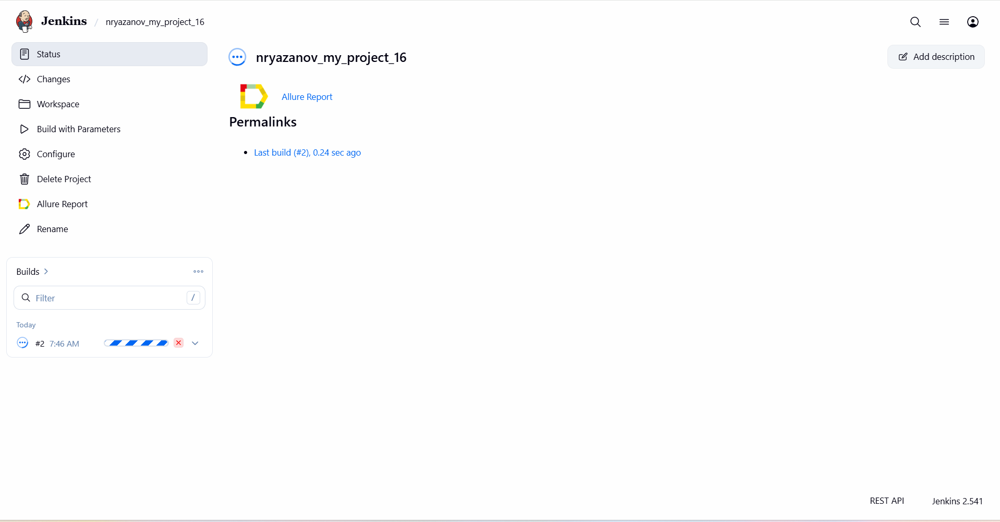
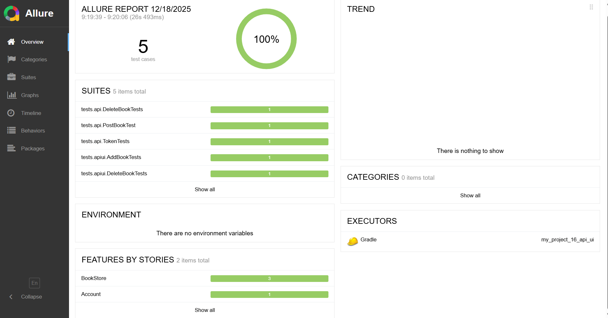
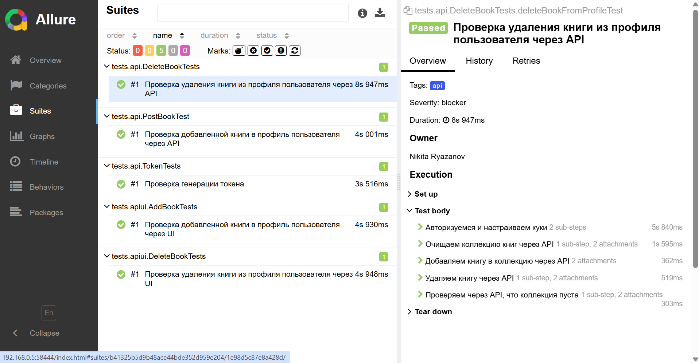
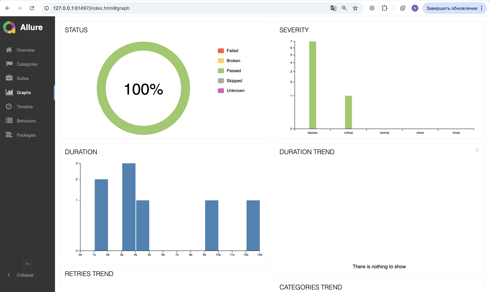

## <a href="https://demoqa.com/"></a>
# Проект по автоматизации тестирования для проекта [DemoQa](https://demoqa.com/)

* [Репозиторий с проектом](https://github.com/nryazanov13/my_project_16_api_ui/tree/configuration)

## **Содержание:**
____

* <a href="#tools">Технологии и инструменты</a>

* <a href="#cases">Примеры автоматизированных тест-кейсов</a>

* <a href="#jenkins">Сборка в Jenkins</a>

* <a href="#console">Запуск из терминала</a>

* <a href="#allure">Allure отчет</a>

____
<a id="tools"></a>
## <a name="Технологии и инструменты">**Технологии и инструменты:**</a>

<p align="center">  
<a href="https://www.java.com/"></a>  
<a href="https://github.com/"></a>  
<a href="https://junit.org/junit5/"></a>  
<a href="https://gradle.org/"></a>  
<a href="https://selenide.org/"></a>  
<a href="https://aerokube.com/selenoid/"></a>  
<a href="https://allurereport.org/"></a>  
<a href="https://www.jenkins.io/"></a>   
</p>

____
<a id="cases"></a>
## <a name="Примеры автоматизированных тест-кейсов">**Примеры автоматизированных тест-кейсов:**</a>
____
API тесты
- ✓ *Проверка генерации токена*
- ✓ *Проверка добавленной книги в профиль пользователя через API*
- ✓ *Проверка удаления книги из профиля пользователя через API*

API и UI тесты
- ✓ *Проверка добавленной книги в профиль пользователя через UI*
- ✓ *Проверка удаления книги из профиля пользователя через UI»*

____
<a id="jenkins"></a>
## </a><a name="Сборка"></a>Сборка в [Jenkins](https://jenkins.autotests.cloud/job/nryazanov_my_project_16/)</a>
____
<p align="center">  
<a href="https://jenkins.autotests.cloud/job/nryazanov_my_project_16/"></a>  
</p>


### **Параметры сборки в Jenkins:**

- *browser (браузер, по умолчанию chrome)*
- *version (версия браузера, по умолчанию 128)*
- *windowSize (размер окна браузера, по умолчанию 1920x1080)*
- *remoteHost (адрес удаленного сервера Selenoid)*

<a id="console"></a>
### Команды для запуска из терминала
___
***Локальный запуск всех тестов:***

- Denv (запуск локально/удаленно, по умолчанию локально)
```bash  
./gradlew clean test -Denv=local
```
***Удаленный запуск всех тестов локально:***
```bash  
./gradlew clean test -Denv=remote
```

***Удалённый запуск через Jenkins:***
```bash  
clean test
-Dbrowser=${browser}
-DbrowserVersion=${browserVersion}
-DbrowserSize=${browserSize}
-DremoteHost=${remoteHost}
```
___
<a id="allure"></a>
## </a> <a name="Allure"></a>Allure [отчет](https://jenkins.autotests.cloud/job/037-sandraboticelli-escaperoom-12/allure/)</a>
___

### *Основная страница отчёта*

<p align="center">  
  
</p>  

### *Тест-кейсы*

<p align="center">  
  
</p>

### *Графики*

  <p align="center">  

</p>

